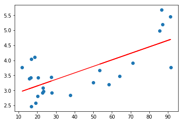
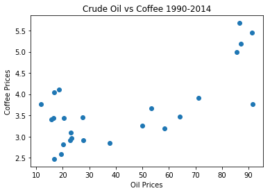

## Linear Function
Version/Date: Sept 20

### Exercise
>PREDICT_400-DL_SEC56
>Wk1 Linear Functions Assignment

### File(s)
Wk1CoffeeOil.ipynb

### Description
Article

#### References
Article: 
http://www.ico.org/documents/cy2014-15/icc-115-6e-study-impact-oil-price-dollar.pdf
Data:
https://inflationdata.com/Inflation/Inflation_Rate/Historical_Oil_Prices_Table.asp
http://www.ico.org/new_historical.asp


```python
%%HTML
<iframe height="600px" width="100%" src="http://www.ico.org/documents/cy2014-15/icc-115-6e-study-impact-oil-price-dollar.pdf"></iframe>
```


<iframe height="600px" width="100%" src="http://www.ico.org/documents/cy2014-15/icc-115-6e-study-impact-oil-price-dollar.pdf"></iframe>


```python
!python --version
```

    Python 3.5.2 -- Enthought, Inc. (x86_64)


```python
# Use matplotlib.pyplot
import matplotlib.pyplot as plt
from numpy import linalg, ones
import numpy as np
```


```python
# Yearly data for crude oil prices from 1990 to 2014
# Source: https://inflationdata.com/Inflation/Inflation_Rate/Historical_Oil_Prices_Table.asp
# Note: this is the independent variable
oil=[23.19,
     20.20,
     19.25,
     16.75,
     15.66,
     16.75,
     20.46,
     18.64,
     11.91,
     16.56,
     27.39,
     23.00,
     22.81,
     27.69,
     37.66,
     50.04,
     58.30,
     64.20,
     91.48,
     53.48,
     71.21,
     87.04,
     86.46,
     91.17,
     85.60]

# Yearly data for coffee prices from 1990 to 2014
# Source: http://www.ico.org/new_historical.asp
# Note: this is the dependent variable
coffee=[2.97,
       2.81,
       2.58,
       2.47,
       3.40,
       4.04,
       3.43,
       4.11,
       3.77,
       3.43,
       3.45,
       3.09,
       2.92,
       2.92,
       2.85,
       3.26,
       3.20,
       3.47,
       3.76,
       3.67,
       3.91,
       5.19,
       5.68,
       5.45,
       4.99]
```


```python
# y = (a*x) + b
# y is the coffee price (dependent var)
# x is the oil price (independent var)
# a is the coefficient or slope for the regression
# b is the intercept residual value
a = 0.45
b = 80.63
#y = (a * x) + b
#plt.plot(y)

x = np.asarray(oil)
A = np.array([x, np.ones(25)])
y = np.asarray(coffee)
w = linalg.lstsq(A.T,y)[0]
line = w[0] * x + w[1]
plt.plot(x, line, 'r-', x, y, 'o')
plt.show()

# see reference link below for explanation
```





```python
%%HTML
<a href='https://glowingpython.blogspot.com/2012/03/linear-regression-with-numpy.html'>Numpy Lin Reg Reference</a>
```


<a href='https://glowingpython.blogspot.com/2012/03/linear-regression-with-numpy.html'>Numpy Lin Reg Reference</a>


```python
plt.scatter(oil,coffee)
plt.title('Crude Oil vs Coffee 1990-2014')
plt.xlabel('Oil Prices')
plt.ylabel('Coffee Prices')
```


    <matplotlib.text.Text at 0x1dc767486a0>


```python
plt.show()
```




